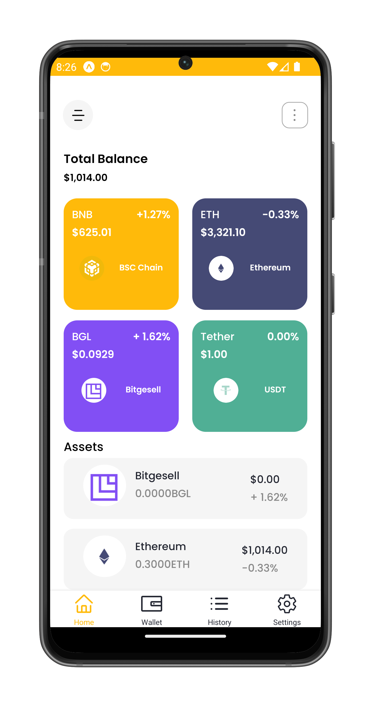

# Sevault-mobile
React Native expo codebase for Bitgesell Sevault Wallet for Android.



## Setting up

1. Install dependencies

```sh
yarn i
```

2. Ensure React Native is set up on local machine, follow official docs [Here](https://reactnative.dev/docs/environment-setup)

3. Setup Android Studio & emulators, follow the official docs [here](https://developers.google.com/privacy-sandbox/private-advertising/setup/android/download)

## Start app

```sh
yarn start
```

NB: refer to `package.json` for more scripts on building the app for various platforms

## Contributions

Contributions are highly welcome, currently:
- iOS support & testing
- Bridge(when new bridge becomes available) feature
- Graph data for crypto prices(Figma designs shall be attached)
